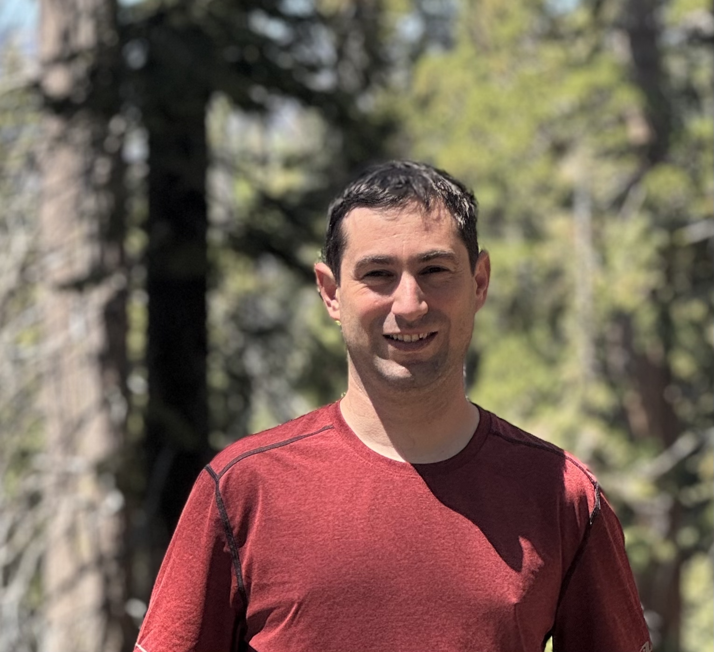
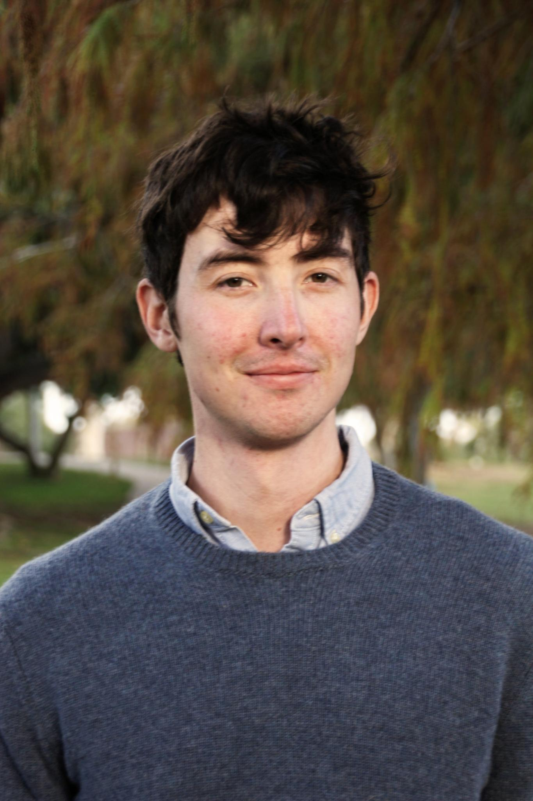
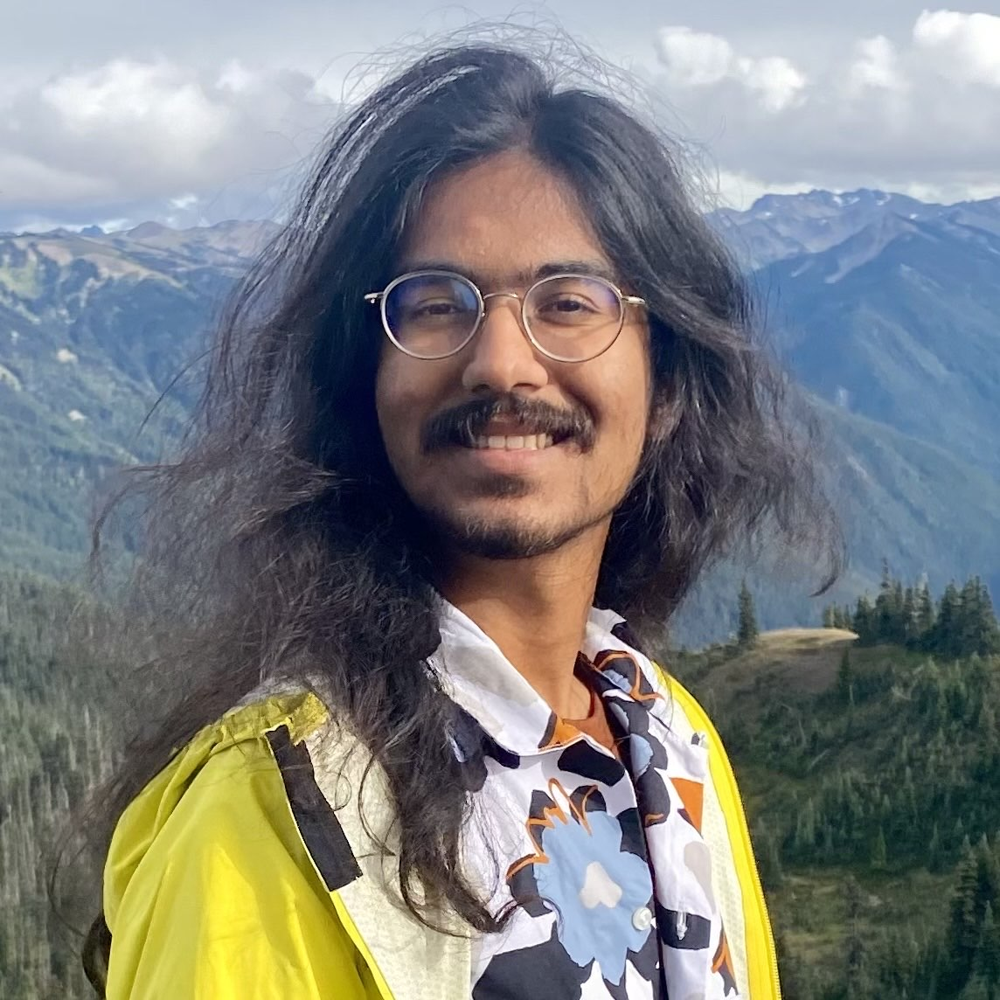
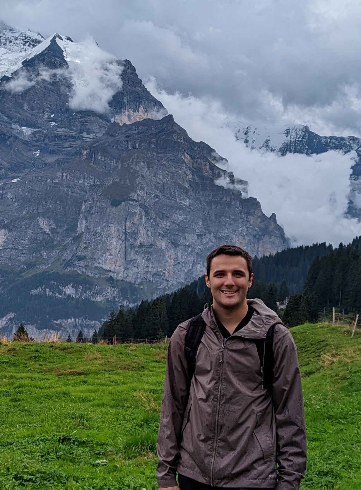
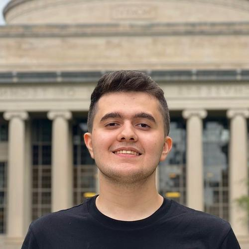
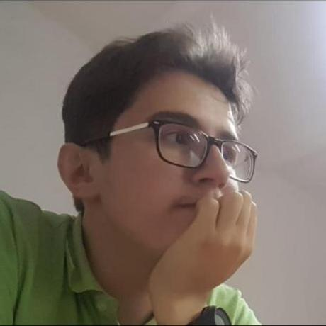
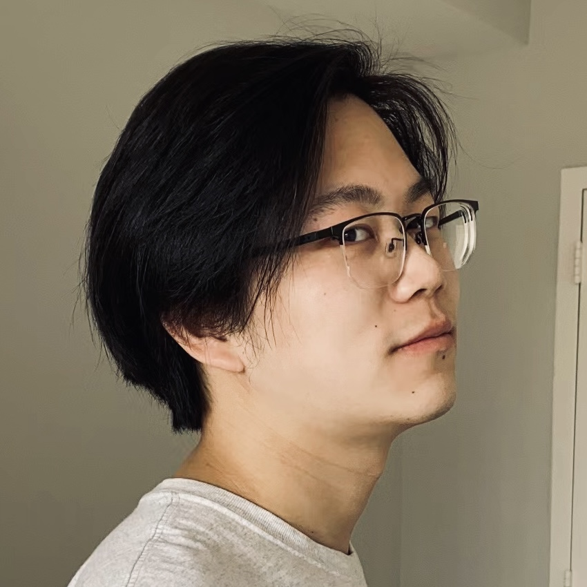

+++
title = 'Home'
date = 2023-01-01T08:00:00-07:00
draft = false
+++

TockWorld is an annual in-person gathering for the [Tock](https://tockos.org) community. Developers, users, and the curious gather from industry and academia for tutorials, talks, and to discuss future development directions of the Tock ecosystem.

TockWorld 8 will take place in Seattle, WA on September 5th, 2025.

## Speakers {.speakers}

*
  ### Bobby Reynolds

  #### Synchronization in Pluton

  

  Bobby Reynolds is a software engineering manager at Microsoft
  specializing in firmware development for embedded systems and novel
  hardware architectures. His team builds firmware for the Pluton
  Security Processor, deriving heavily from Tock OS.

  * [GitHub](https://github.com/reynoldsbd)
  * [LinkedIn](https://www.linkedin.com/in/reynoldsbd3/)
  {.socials}

*
  ### Alexandru Radovici

  

  #### Bringing async to kernel

  Alexandru Radovici is the CEO of Wyliodrin, a software services
  company, providing training and development mostly in Rust. He is an
  Associate Professor at the Politehnica University in Bucharest where
  he introduced the first Rust development course for embedded
  systems. He has been contributing to Tock for almost five years.

  * [GitHub](https://github.com/alexandruradovici)
  * [ X](https://twitter.com/wyliodrin)
  * [LinkedIn](https://www.linkedin.com/in/alexandruradovici/)
  {.socials}

*
  ### Evan Johnson

  

  #### Verified Isolation in Tock

  Evan Johnson is an assistant professor in Computer Science and
  Engineering at NYU. His research focuses on solving hard security
  problems in real-world systems using lightweight, practical
  verification. He completed his PhD at UC San Diego, advised by Deian
  Stefan and Stefan Savage.

  * [WWW](https://enjhnsn2.github.io/)
  * [GitHub](https://github.com/enjhnsn2)
  {.socials}

*
  ###  Hussain Miyaziwala

  

  #### Data Movement Patterns in Pluton

  Hussain is a software engineer at Microsoft, specializing in
  embedded security and firmware development.

*
  ### Samir Rashid

  

  #### Formally verifying virtual alarms

  Student at University of California, San Diego. NixOS enthusiast.

  * [WWW](https://godsped.com/)
  * [GitHub](https://github.com/Samir-Rashid)
  * [Bluesky](https://bsky.app/profile/godsped.com)
  * [ X](https://twitter.com/Rash_Samir)
  {.socials}

*
  ### Tyler Potyondy

  

  #### Improving Driver Safety with TypeStates

  Tyler is a graduate student at UCSD who works to improve the
  security and robustness of embedded systems. Tyler is a contributor
  and maintainer of TockOS (embedded Rust OS).

  * [GitHub](https://github.com/tyler-potyondy)
  * [LinkedIn](https://www.linkedin.com/in/tyler-potyondy-88553b124/)
  {.socials}

*
  ### Beshr Islam Bouli

  

  #### Enabling ropi-rwpi PIC in LLVM

  Beshr is a junior at MIT studying computer science with a background in
  competitive programming—earning a bronze medal at the Asian Pacific
  Informatics Olympiad and participating at the International Olympiad
  in Informatics. His interest in systems began with hacking on xv6
  and building distributed systems inspired by Raft. He is currently a
  member of MIT's Parallel and Distributed Operating Systems Group,
  where he works on SigmaOS, a multi-tenant cloud operating system. He
  also helps teach MIT's operating systems course and is a developer
  at MIT Battlecode, a real-time strategy AI competition with over
  2,000 participants annually.

  * [LinkedIn](https://www.linkedin.com/in/beshr-islam-bouli-9a508b216/)
  {.socials}

*
  ### Darius-Andrei Jipa

  

  #### ARMv8-M Architecture Port

  Darius is a senior year student at the Politehnica University of
  Bucharest. He likes working with embedded devices and with systems
  programming. He started working with the Tock Operating System during
  his first year at the university. Since then, he fixed a number of bugs
  and ported some boards to the Tock operating system, including the
  Raspberry Pi Pico 2 board.

  * [LinkedIn](https://www.linkedin.com/in/darius-andrei-jipa-aa33421a8)
  {.socials}

*
  ### Gongqi Huang

  

  #### Tick-Tock-Tock-Tock... Tock Goes Multicore

  Gongqi is a third-year PhD candidate at Princeton with interests in
  building secure and efficient systems, advised by Amit Levy who has
  the superpower of invisibility. Aside from their research, Gongqi is
  constantly seeking ways and guidance to defeat the said superpower.

  * [WWW](https://gongqihuang.com/)
  {.socials}
