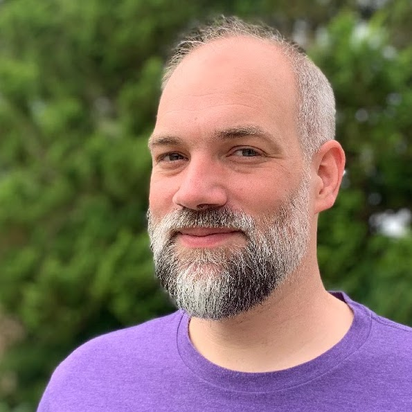
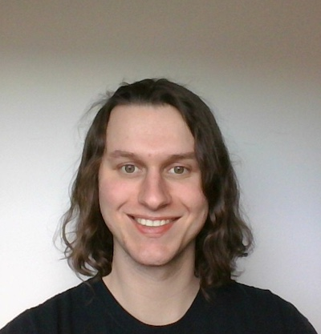
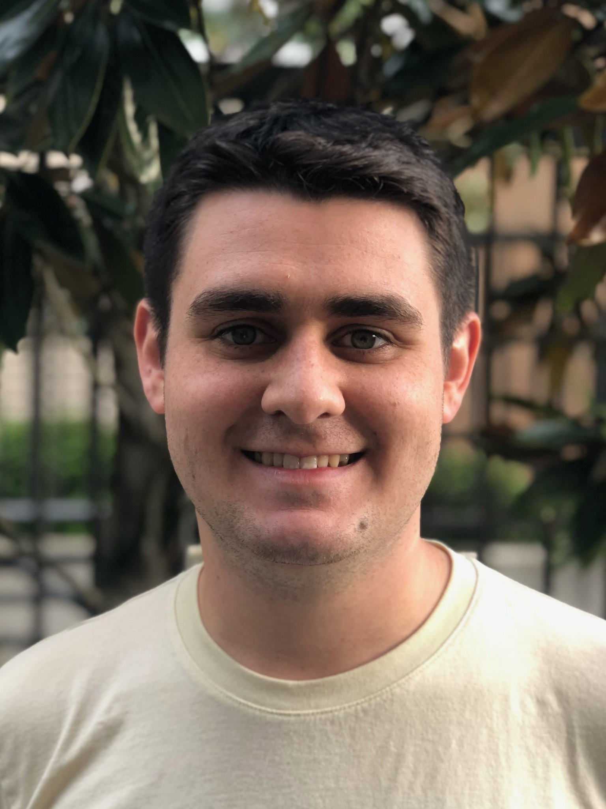
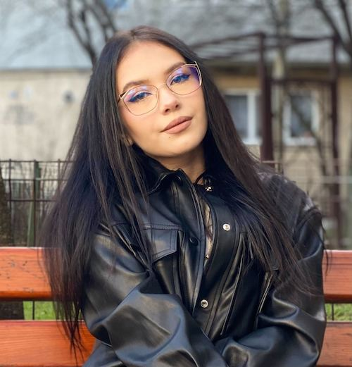
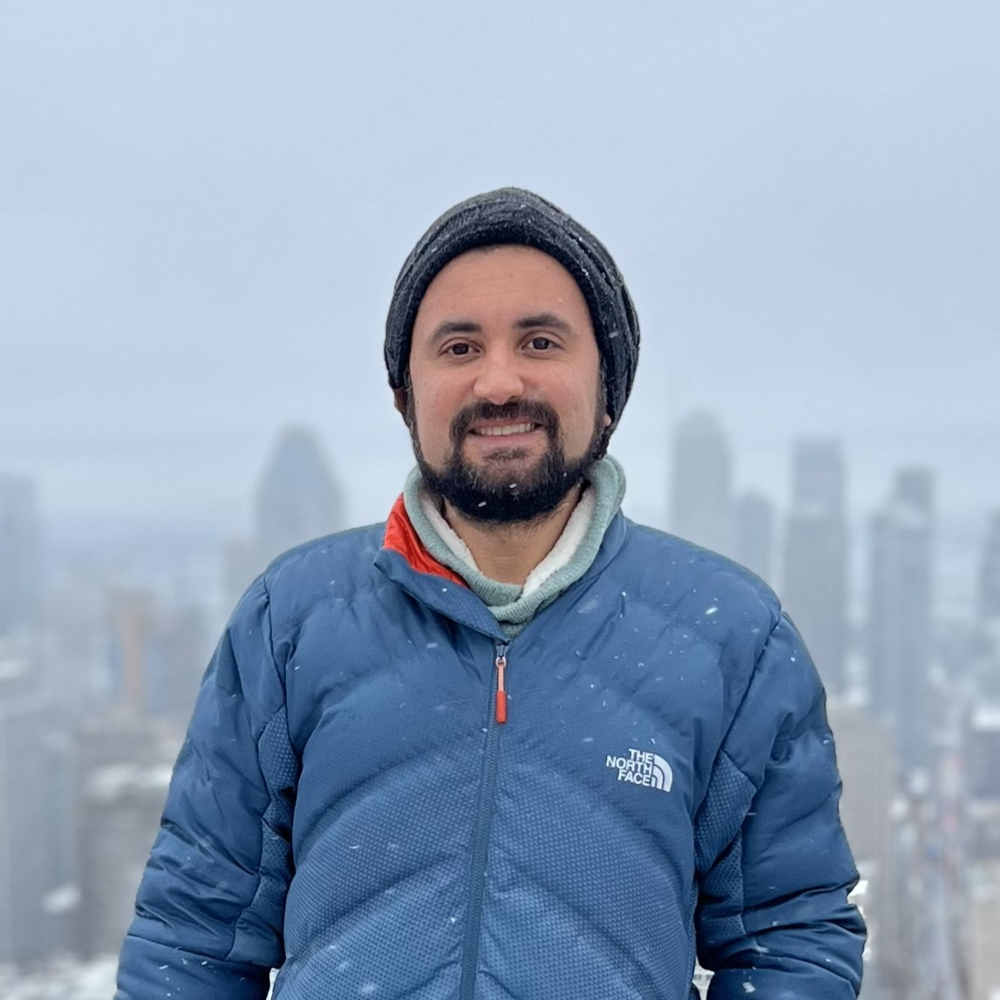
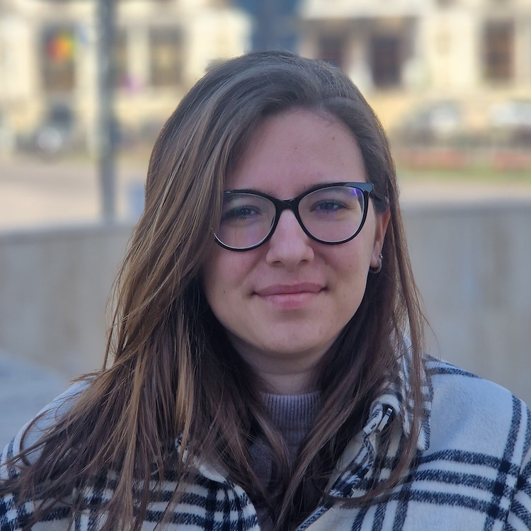
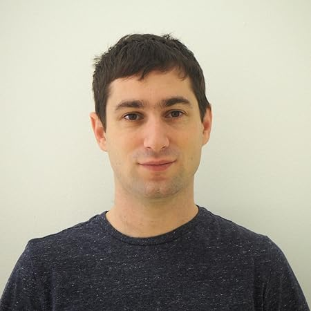

+++
title = 'Home'
date = 2023-01-01T08:00:00-07:00
draft = false
+++

TockWorld is an annual in-person gathering for the [Tock](https://tockos.org) community. Developers, users, and the curious gather from industry and academia for tutorials, talks, and to discuss future development directions of the Tock ecosystem.

TockWorld 7 will take place in San Diego, CA, at UC San Diego on June 26-28, 2024.

## Student Travel Grants

Are you a student interested in attending TockWorld? [Apply here](grant) for a travel grant.

## Speakers {.speakers}

*
  

  ### Florian Gilcher

  #### Keynote: tRust

  Florian Gilcher is one of the co-founders and management directors
  of Ferrous Systems. Previously, he was part of the Rust project, as
  part of the community and core team, and a co-organizer of the Rust
  Berlin Meetup and the RustFest conference.  He currently leads the
  Ferrocene project, qualifying Rust project's compiler to highest
  assurances.

  * [GitHub](https://github.com/skade)
  * [ X](https://twitter.com/@argorak)
  * [Mastodon](https://hachyderm.io/@skade)
  {.socials}

*
  

  ### Lawrence Esswood

  #### CHERI for Tock

  Dr Lawrence Esswood did his PhD at the Computer Laboratory in Cambridge on
  designing CHERI operating systems with mutual distrust between users and the
  OS. He now works at Google.

*
  ### Bobby Reynolds

  #### Porting Tock to x86 for Pluton

  

  Bobby Reynolds is a software engineer at Microsoft specializing in
  firmware development for embedded systems and novel hardware
  architectures. His team builds firmware for the Pluton Security
  Processor, and he leads an initiative to adopt Tock OS as the basis
  for all Pluton firmware.

  * [GitHub](https://github.com/reynoldsbd)
  * [LinkedIn](https://www.linkedin.com/in/reynoldsbd3/)
  {.socials}

*
  ### Irina Nita

  

  #### Running Tock OS on WebAssembly

  Irina Nita is a Computer Engineering graduate now at OxidOS Automotive
  who is passionate about Rust in Embedded Systems.
  OxidOS Automotive is a Rust-based secure ecosystem for safety critical
  automotive ECUs.
  Irina's most recent project builds support for running a fully virtualized
  Tock OS using WebAssembly.

  * [GitHub](https://github.com/irina-nita)
  {.socials}

*
  ### Gustavo Scotti

  

  #### Porting Tock to x86 for Pluton

  Gustavo 'aka Gus' is a Principal Software Dev Lead at Microsoft, leading the
  Pluton hardware team for upcoming hardware platforms. In my spare time, I
  like to hike the PNW, and to travel around the world for the best vegan
  restaurants.

*
  ### Amalia Camelia Simion

  

  #### Multiplexing Serial Port Messages

  Amalia is a Computer Engineering graduate now at Wyloiondrin.
  She has been doing Rust in embedded systems for two years. Her bachelor
  project consisted of a contribution to the UART HIL mechanism in Tock
  which newly enables efficient multiplexing of a single serial channel
  across apps.

*
  ### Alexandru Radovici

  

  #### Teaching Embedded Systems with Tock

  Alexandru Radovici is an Associate Professor at the Politehnica University in
  Bucharest where he introduced the first Rust development course for embedded
  systems. He has been contributing to Tock for almost four years.

  * [GitHub](alexandruradovici)
  * [ X](https://twitter.com/wyliodrin)
  * [LinkedIn](https://www.linkedin.com/in/alexandruradovici/)
  {.socials}
