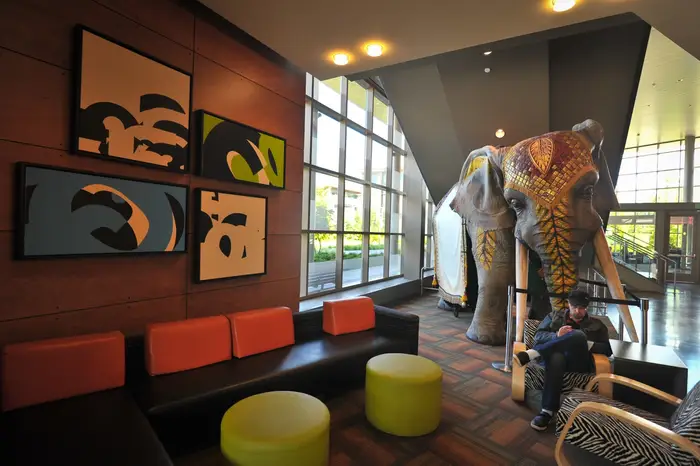

+++
title = "Venue"
draft = false
+++

TockWorld 8 will take place in the Seattle area, hosted by Microsoft
on their Redmond campus. Talks will be at the "Mixer," part of the
Microsoft Commons.

{.photos}

## Getting there

### By Air

The Seattle area is served by [Seattle-Tacoma International Airport
(SEA)](https://www.portseattle.org/sea-tac), with direct flights to
most major airports in North America as well as connections to Europe,
Asia and Central and South America.

SeaTac is approximately 15 miles from downtown Seattle and 20 miles
from Microsoft.

#### Other Airport Options

Other major airports within a reasonable drive or train include
[Portland International Airport](https://www.flypdx.com) and
[Vancouver International Airport](https://www.yvr.ca).

[King County International
Airport](https://kingcounty.gov/en/dept/executive-services/transit-transportation-roads/airport)
is a smaller airport in Seattle with commercial flights to/from the
San Juan Islands; Victoria, BC; Portland; and Bellingham.

There are a number of seaplane bases on Lake Union and Lake Washington
with commercial flights to the San Juan Island and throughout British
Columbia.

### By Train

[Amtrak Cascades](https://amtrakcascades.com/) runs from Vancouver, BC
via Seattle down the Washington State and Oregon to Eugene.

[Amtrak Coast Starlight](https://www.amtrak.com/coast-starlight-train)
runs between Los Angeles and Seattle through Santa Barbara, the San
Francisco Bay Area, Sacramento and Portland.

### By Car

The Seattle area is on the I-5 corridor---approximately a 2.5 hour
driver from Vancouver, BC and a 3 hour drive from Portland---and the
I-90 corridor connecting Spokane, Bozeman, Minneapolis, Chicago,
Clevland, Buffalo, and Rochester.

## Local Transportation

### Public Transit

Microsoft Commons is across a footbridge from the [Redmond Technology
Station](https://www.soundtransit.org/ride-with-us/stops-stations/redmond-technology-station?route_tab=arrivals).

Light rail line number 2 runs from Bellevue via the Redmond Technology
Station to downtown Redmond. A 14 minute ride downtown Bellevue
hotels.

The sound transit system busses are quite efficient and a variety of
busses connect Redmond Technology Station to Seattle and the eastside:

* From Downtown Seattle: ST 545 in 22 minutes
* From University of Washington: ST 542 in 17 minutes

### Bike

The Seattle area has an extensive bike trail network along with well
marked and often separated bike lanes. Weather in September is
typically perfect for cycling---mostly sunny with mild temperatures.

Microsoft is on the SR 520 bicycle trail, making it conveniently
accessible from many parts of Seattle and the eastside (Bothell,
Redmond, Bellevue).

Some representative routes:

* [From the McMenamins hotel in Bothell](https://maps.app.goo.gl/UH9ymdFbu5WLJPPC7) (11.5 miles, 1 hour)
* [From the the Fremont neighborhood](https://maps.app.goo.gl/ybWhYkKBkL72oii7A) (12.5 miles, 1 hour 15 minutes)

Seattle area busses and light rail have bike racks, and many parts of
the area are even more accessible by a bike+bus combination.

### Parking

There is underground parking beneath the conference venue.

## Where to Stay

There are a variety of hotel options in the area.

### Near Microsoft

* [Residence Inn Seattle Bellevue](https://www.marriott.com/en-us/hotels/bvuwa-residence-inn-seattle-bellevue/overview/)
* [Aloft Seattle Redmond](https://www.marriott.com/en-us/hotels/seaad-aloft-seattle-redmond/overview/)

### Downtown Seattle

* [Hyatt Regency Seattle](https://www.hyatt.com/hyatt-regency/en-US/sears-hyatt-regency-seattle),
  the RustConf hotel.
* [The Weston Seattle](https://www.marriott.com/en-us/hotels/seawi-the-westin-seattle/overview/)
* [Inn at the Market](https://www.innatthemarket.com/)
